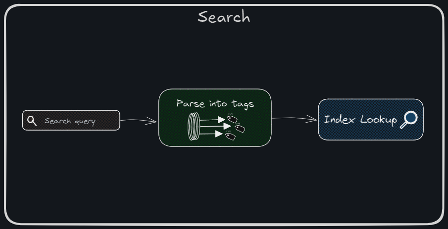

# Search Microservice
**Part of Video Search Engine Project**

This repository contains a Flask-based web service for searching videos in a MySQL database. The service accepts search queries and returns the matching video information.



The Search Service is a critical component of the Video Search Engine system, enabling efficient retrieval of multimedia content based on user queries. It leverages both MySQL and Elasticsearch to provide a comprehensive and accurate search functionality.

### 1. Query Parsing and Tag Extraction
- Accepts user search queries in natural language, such as "videos of dogs on the beach."
- Utilizes a Natural Language Processing (NLP) module to extract relevant search tags (e.g., "dogs," "beach").
- Converts complex user queries into structured tags that can be matched against the database indices.

### 2. Index Lookup
- Vision Data: Tags derived from video frames and images are stored in MySQL. The service searches these tags to locate relevant media files.
- Voice Data: Audio transcriptions from videos are indexed in Elasticsearch. The service queries Elasticsearch to match spoken content with the user’s query.

### 3. File Retrieval
- The service consolidates results from both databases based on the file_type (video, audio, image, text, PDF) and the extracted tags.
- Results are merged into a unified JSON response for the API, ensuring seamless integration with the frontend.

## Key Features
- **Tag-Based Matching**: Efficiently narrows down results by matching tags with database indices.
- **Multi-Format Support**: Handles a variety of file types, ensuring flexibility in content retrieval.
- **Natural Language Support**: Enables intuitive search without requiring users to provide structured input.
- **REST API Integration**: Provides a robust API for sending natural language queries and receiving consolidated, structured JSON responses.
- **Comprehensive API Response**: Returns detailed JSON responses, including search query, extracted tags, matching tags, and result metadata (e.g., file ID, name, and match type: speech, vision, or vsn-sph), ensuring clarity and transparency in search results.

## Installation
### Prerequisites
- Python 3.12
- Elastic search service
- MySQL service
- Depends on
    - ViT microservice
    - ASR microservice

### Steps
1. Clone the repository:
   ```bash
   git clone https://github.com/iam-VK/search_service
   cd search_service
2. Install the required dependencies:
    ```bash
    ./setup.sh
3. Run the Flask application:
    ```bash
    ./run.sh
4. The service will be available at `http://localhost:5003`
5. API calls can be made to the app server

## Endpoints
- ### Service Status
    - URL: /
    - Method: GET or POST
    - Response:
    ```json
    {
        "status": "Alive",
        "endpoints": {
            "/search": {
                "method": "[GET]",
                "parameters": {
                    "search_query": "video tag / search query",
                    "file-type": "file type"
                }
            }
        }
    }
- ### Video Search

    - URL: /search
    - Method: GET
    - Request: Query Param with search query (search_query)
    - Response:
    ```json
    {
        "status": "SUCCESS",
        "total_results": "<number_of_results>",
        "search_query": "<search_query>",
        "extracted_tags": "<list of search tags from search query>",
        "hitting_tags": "<list of matching tags>",
        "results": [
            {
                "file_id": "<file_id>",
                "file_name": "<file_name>",
                "match_type": "<speech/vision/vsn-sph>",
                "matching_tags": "<list of matching tags>"
            },
            ...
        ]
    }
<!-- ## Project Structure
```bash
    search_service/
    ├── API_SERVER.py         # Flask application
    ├── mysql_DB.py           # MySQL database interactions
    ├── requirements.txt      # List of dependencies
    ├── README.md             # Project README
    ├── setup.sh              # Setup virtual env and install dependencies
    └── run.sh                # Starts the microservice   -->